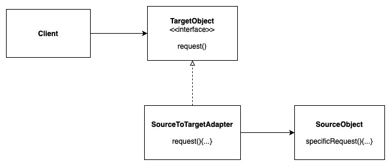
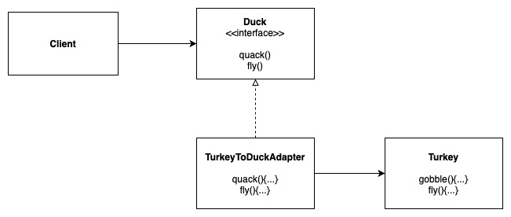
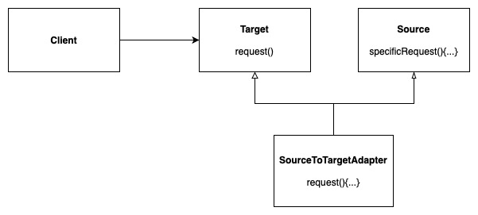

# (Object) Adapter Pattern

Converts the interface of a class into another interface the client expect. Adapter lets classes work together that could not otherwise because of incompatible interfaces.

Decorator: Adds new responsibilities/features to objects

Adapter: Converts one interfaces to another

Facade: Simplifies an interface

## Design Solution

### Example 1: Turkey to Duck Adapter

# Class Adapter Pattern (multi inheritance)

