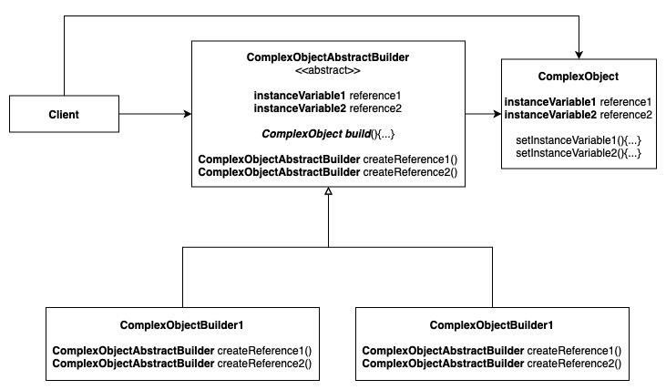
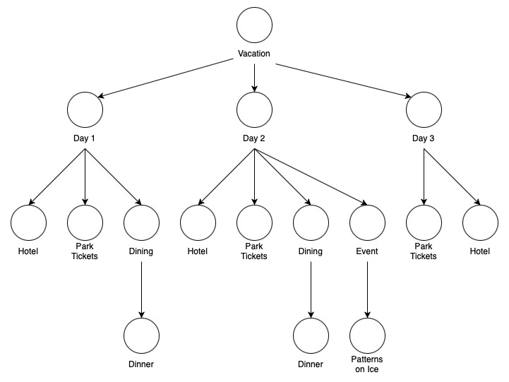
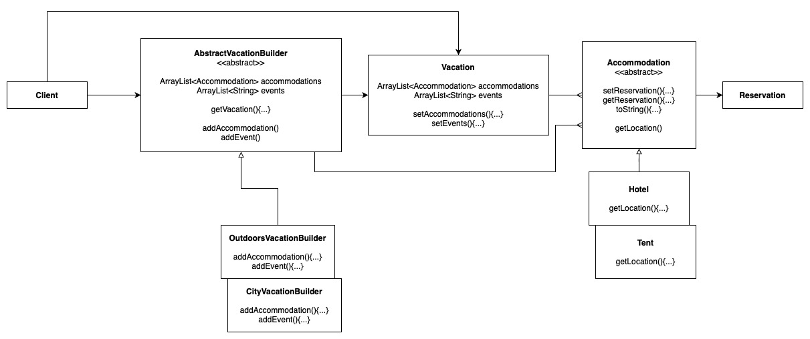
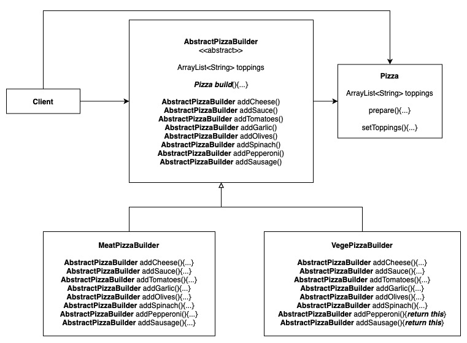

# The Builder Pattern

This pattern allows us to encapsulate the way a complex object is constructed into multi-step method calls. The steps can be swapped in and out, following any order, forming sort of like a pipeline.

## Solution Design

## Example 1: Vacation Builder

Vacation Object Tree Diagram:

Vacation Object Builder Solution:

## Example 2: Pizza Builder

Vacation Object Tree Diagram:

## Other Examples

[Example in NodeJS](https://github.com/asyrul21/design-patterns-nodejs/tree/master/creational/builder)