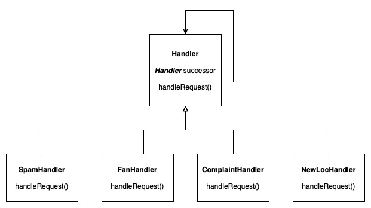

# The Chain of Responsibility Pattern

This pattern is used when you want to give more than one object a chance to handle a request. This is done by chaining the receiving objects and pass the request along the chain.

## Solution Design

## Examples

[Example in NodeJS](https://github.com/asyrul21/design-patterns-nodejs/tree/master/behavioral/COR)