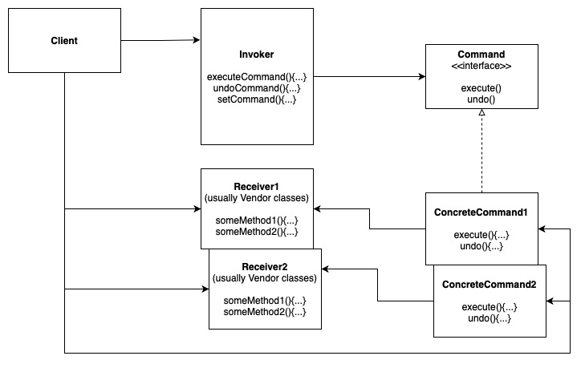
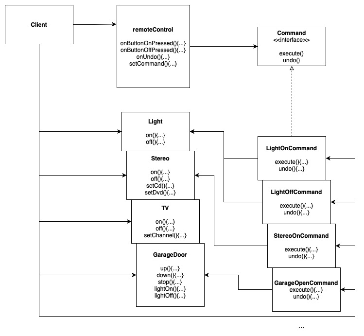

# Decorator Pattern

Encapsulates a request as an object, thereby letting you parameterize other objects with different requests, queue or log requests, and support undoable operations.

Wraps Receiver with a Concrete Command Object. Command objects are store in Invoker, which will run the `execute(){}` method of the command object upon request.

## Design Solution

### Example 1: Remote Control

