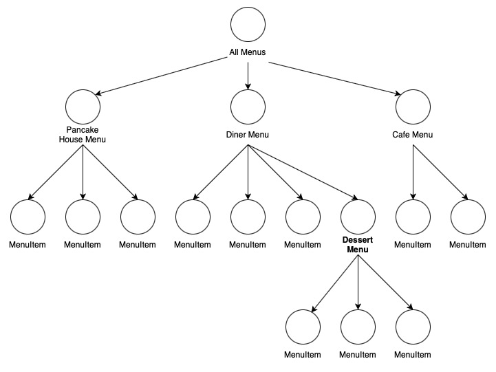
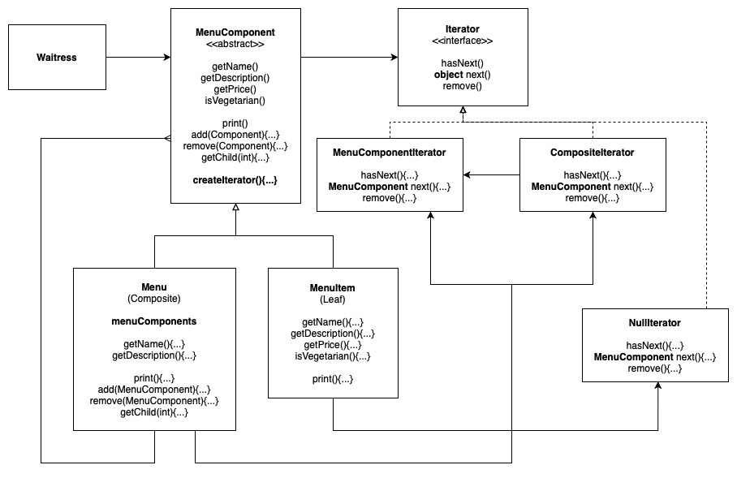

# Composite Pattern

Allows you to compose objects into Tree Structures to represent part-whole hierarchies. Composite lets clients treat individual objects (Tree Leaf nodes) and composition of objects (Tree Branch Nodes) uniformly.

In the abstract class, default method implementations are generally provided, allowing Subclasses to override ONLY the methods that makes sense, either if the Subclass is Leaf component or a composite.

Related Example: Iterator Pattern

## Design Solution

### Example 1: The Merged Menu with Desserts

The tree structure:

Composite pattern example:

### Example 2: Composite Iterator

Composite Iterator allows us to iterate through a Composite Tree.

The example in the book used Java's built-in Iterator interface. However, for this example we built an Iterator implementation from scratch. Hence, the design below differs slightly than that of the one in the book.

## Alternative Implementation

There is another example on implementing Composites, which I believe might be better than ones provided in the examples here. See [Visitor](https://github.com/asyrul21/designPatternsReference/tree/master/src/VisitorPattern).

## Other Examples

[Example in NodeJS](https://github.com/asyrul21/design-patterns-nodejs/tree/master/structural/composites)

