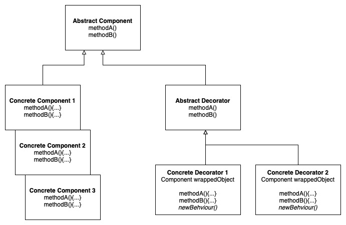
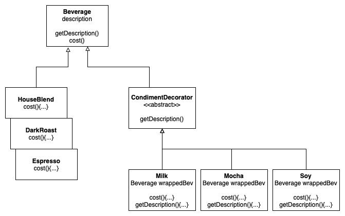

# Decorator Pattern

Attaches additional responsibilities to an object dynamically. Decorators provide a flexible alternative to subclassing for extending functionality.

## Design Solution

### Example 1: Starbuzz Coffee

# Other Examples

[Example in NodeJS](https://github.com/asyrul21/design-patterns-nodejs/tree/master/structural/decorator)

