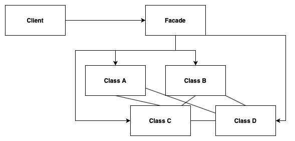
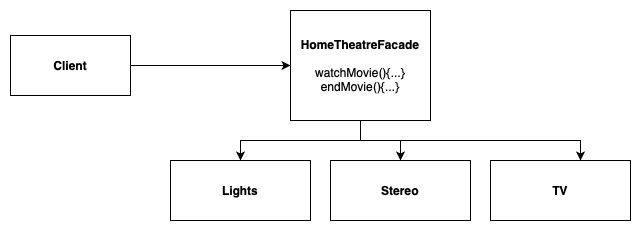

# Facade Pattern

Provides a unified and simplified interface to a set of interfaces in a subsystem. Facade defines a Higher Level interface that makes the subsystem easier to use.

Decorator: Adds new responsibilities/features to objects

Adapter: Converts one interfaces to another

Facade: Simplifies an interface

## Design Solution

### Example 1: Home Theatre Facade

