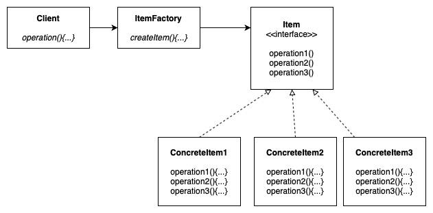
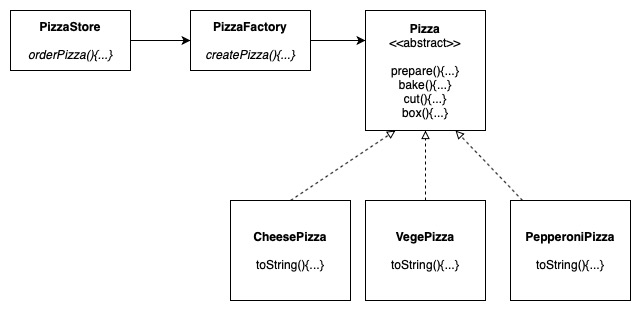
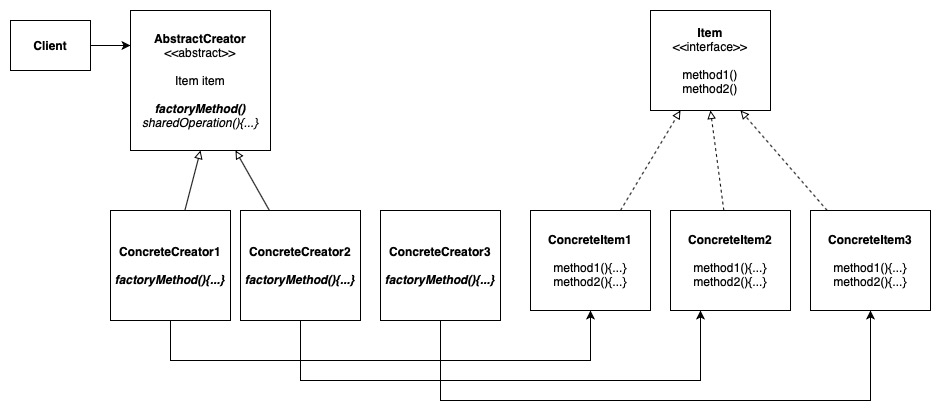
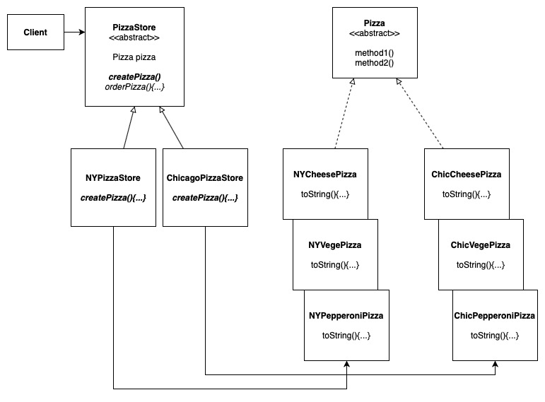
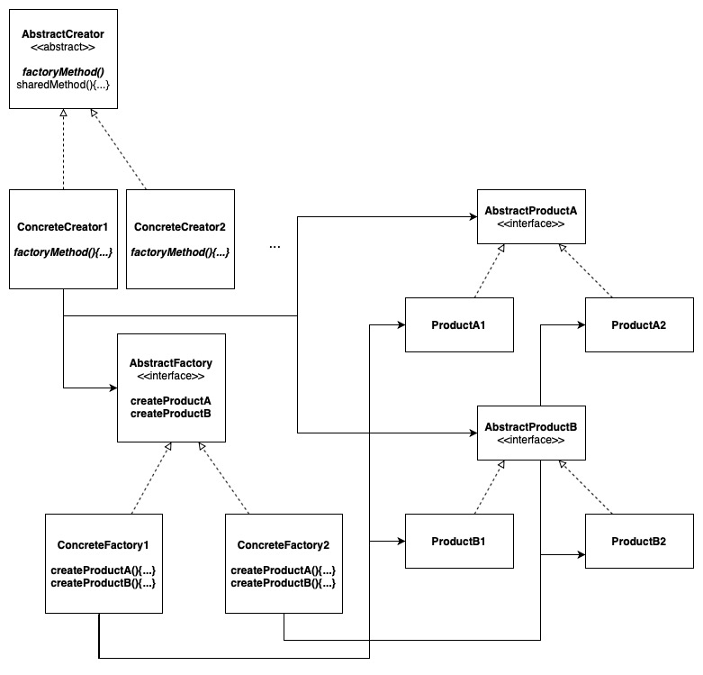
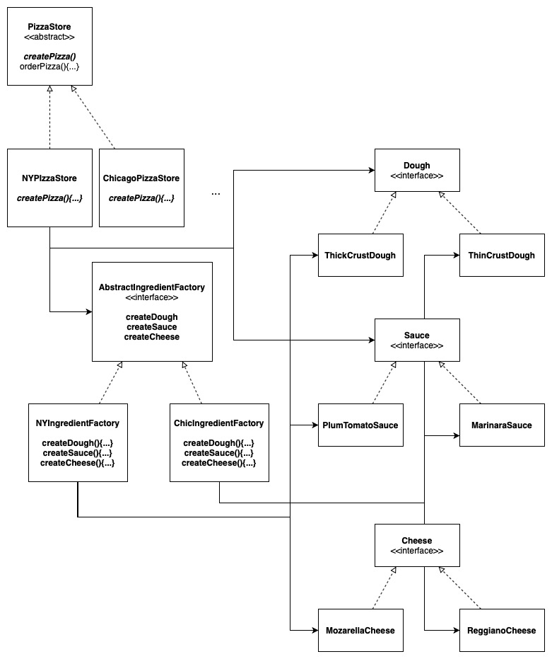
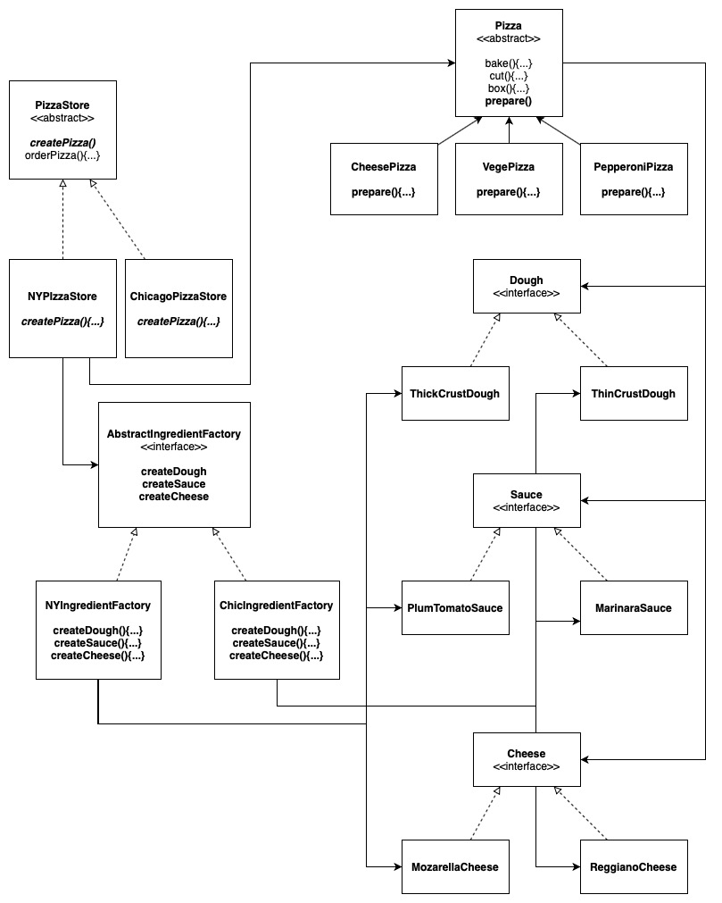

# Factory Patterns

There are three factory patterns covered in the book:

1. Simple Factory

2. Factory Method

3. Abstract Factory

## To Run via the Terminal

1. Navigate to */src*

2. Compile the class:

    ```bash
    javac FactoryPattern/FactoryMethod/FactoryMethodMain.java
    ``` 

3. Run

    ```bash
    java FactoryPattern.FactoryMethod.FactoryMethodMain
    ```
   
NOTE: In factory pattern the convention is altered slightly:
 
 `FactoryPattern.[type of factory pattern].[main]`

# Simple Factory

Simple Factory is not really a design pattern, it is more of a programming idiom, where the instantiation of objects is encapsulated into a seperate class.

## Design Solution



### Example: Pizza Store



# Factory Method

The Factory Method defines an interface for creating an object, but lets subclasses decide which class to instantiate. Factory Method lets a class DEFER instantiation to subclasses.

## Design Solution



### Example: Pizza Store for Multiple Regions




# Abstract Factory

The Abstract Factory pattern provides an interface for creating FAMILIES of related or dependent objects without specifying their concrete classes.

## Design Solution



### Example: Pizza Store for Multiple Regions with Region-specific ingredients



### Example: Pizza Store for Multiple Regions with Region-specific ingredients (Revised)


