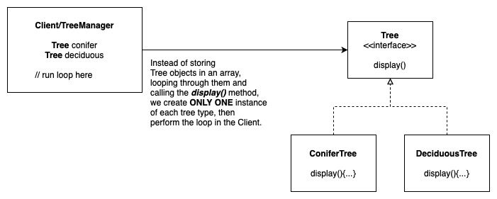

# The Flyweight Pattern

This pattern allows us to reduce the number of object instances being created at runtime. For example when multiple instances of an object is stored in an Array, when we need to perform one method, we will have to loop through all array and calling the method. Instead, we create only one instance of the object, and perform the loop at the client.

## Example 1: Trees Manager

