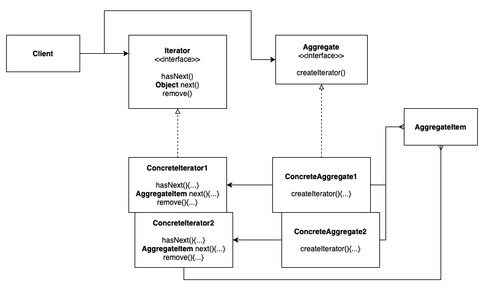
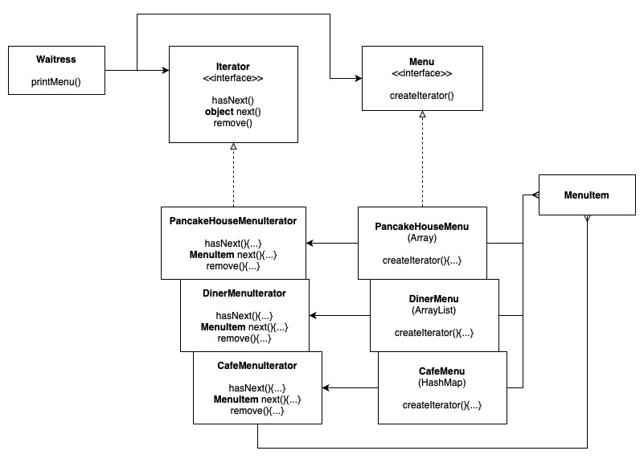

# Iterator Pattern

Provides a way to access the elements of an aggregate object sequentially without exposing its underlying representation - either if its an Array, ArrayList, HashMap, etc.

Related Example: Composite Pattern

## Design Solution

### Example 1: The Merged Menu

## Other Examples

[Example in NodeJS](https://github.com/asyrul21/design-patterns-nodejs/tree/master/behavioral/iterator)

