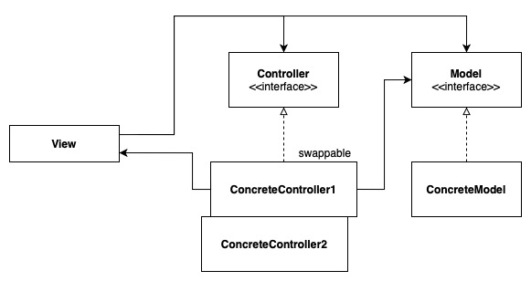
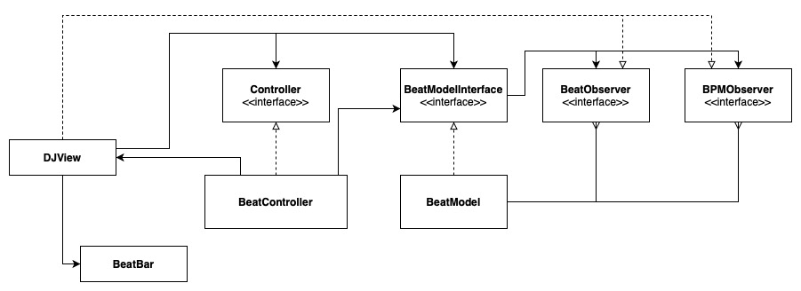
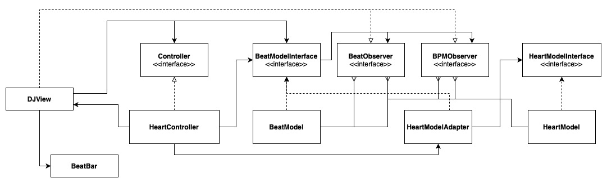

# The Model-View-Controller

The MVC is generally an adaptation of:

- Model - The Observer Pattern

- View - The Strategy Pattern

- Controller - The Composite Pattern

There are two type of MVC:

1. Traditional

2. Web-based (a.k.a Model 2)

## High Level Solution

### Example 1: DJ View Beat

### Example 2: DJ View Beat with Adapted Heart Model

### Example 3: The Model 2

This example has been removed in the 2020 version of the book. It makes sense, since there are many MVC frameworks that are widely used today.

However, you can run the Example 3's HttpServerMain server code.

The JSP does not work just yet, as I am still figuring out how to run the jsp file.