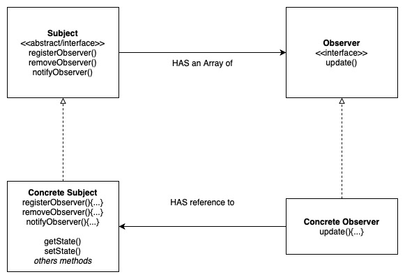
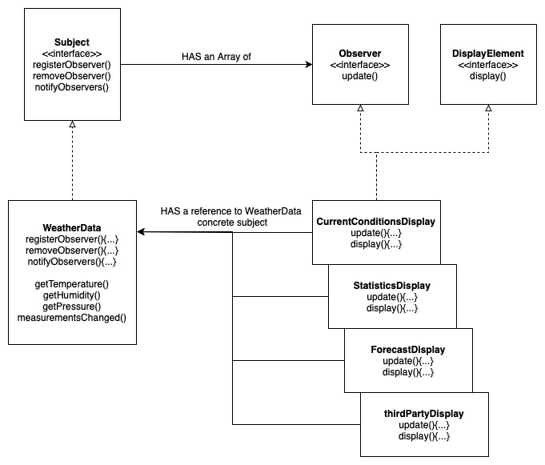

# Observer Pattern

Defines a one to many dependency between objects so that when one object changes state, all of its dependencies are notified and updated accordingly.

## Design Solution

### Example 1: Weather-O-Rama

