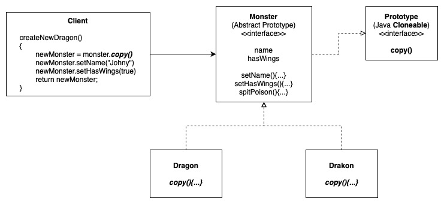

# The Prototype Pattern

This pattern is used when creating an instance of a given class which is either expensive to create or complicated. For example, instead calling the Constructor of a huge object, we simply clone an existing one, and make modifications from there.

## Example 1: Monster Prototype

## Other Examples

[Example in NodeJS](https://github.com/asyrul21/design-patterns-nodejs/tree/master/creational/prototype)
