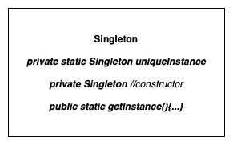
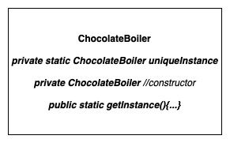

# Singleton Pattern

Ensures a class has only one instance, and provides a global point of access of it.

## Design Solution

### Example 1: Chocolate Boiler

## Other Examples

[Example in NodeJS](https://github.com/asyrul21/design-patterns-nodejs/tree/master/creational/singleton)

