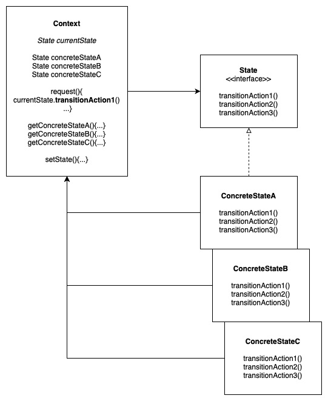
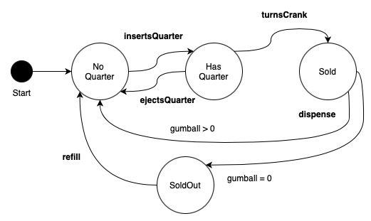
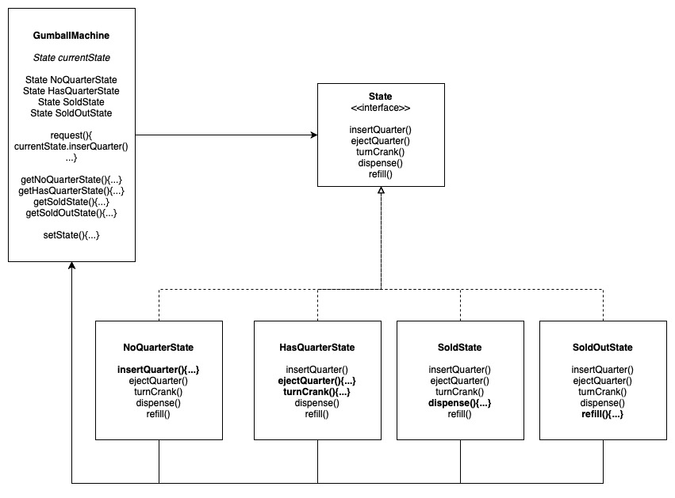

# State Pattern

Allows an object to alter its behaviour when its internal state changes. The object will appear to change its class.

Related Example: Proxy Pattern

## Design Solution

### Example 1: The Gumball Machine

State Machine Diagram:

State pattern example:

