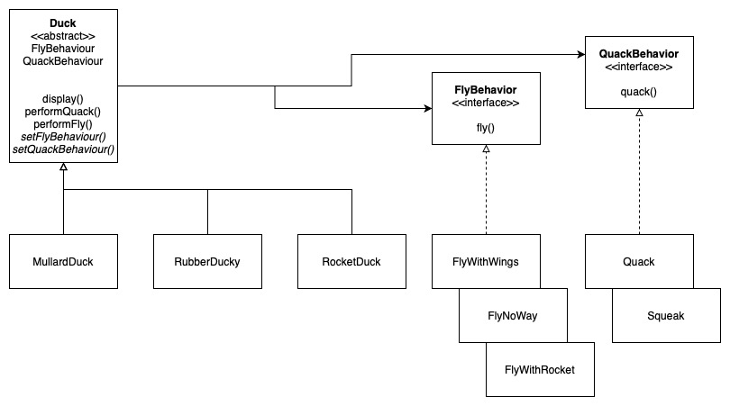
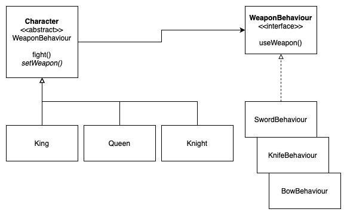
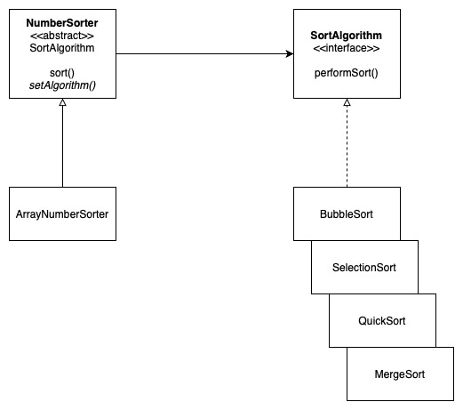

# Strategy Pattern

Defines a family of algorithms, encapsulate each one, and makes them interchangeable at runtime.

## Examples

### Example 1: The SimuDuck

### Example 2: The Game Character

### Example 3: The NumberSorter

## Other Examples

[Example in NodeJS](https://github.com/asyrul21/design-patterns-nodejs/tree/master/behavioral/strategy)

