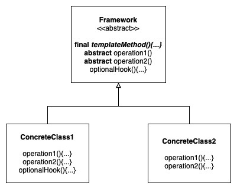
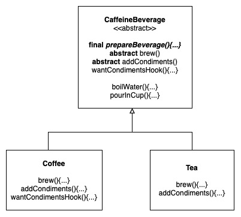

# Template Method Pattern

Defines the skeleton of an algorithm in a method, deferring some steps to subclasses. Template Method lets subclasses redefine certain steps of an algorithm without changing the algorithm's structure.

Strategy: Encapsulates interchangeable behaviours and use delegation to decide which behaviour to use.

Template Method: Subclasses decide how to implement specific steps of an algorithm.

Factory Method: A specialisation of Template Method: Subclasses decide which concrete classes to instantiate.

## Design Solution

### Example 1: Coffee/Tea Recipe

